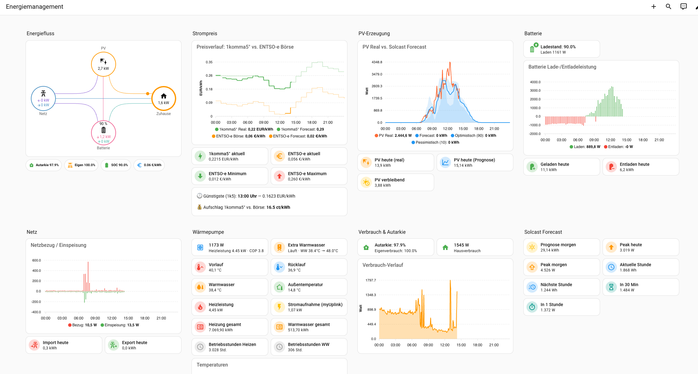

# Home Assistant – Energiemanagement

Projekt-Dokumentation für den Aufbau eines DIY-Energiemanagementsystems mit Home Assistant.



## Setup

| Komponente | Details |
|---|---|
| **PV-Anlage** | ~9.3 kWp (Ost/West), Sungrow SH10RT Hybrid-Wechselrichter |
| **Batterie** | 12.8 kWh Sungrow SBR128 |
| **Wärmepumpe** | Novelan LICV 8.2 (myUplink + Shelly 3EM) |
| **HA-Server** | KAMRUI N100 Mini PC, HA OS 17.1 |
| **Remote** | https://ha.schowalter.co (Cloudflare Tunnel) |
| **NAS** | Synology DS218+ (Backups) |

## Integrationen

| Integration | Zweck |
|---|---|
| **mkaiser Sungrow Modbus** | Echtzeit-Daten Inverter + Batterie via gridBox |
| **1komma5° (HACS)** | Dynamische Strompreise (Dynamic Pulse) |
| **ENTSO-e (HACS)** | Day-Ahead Börsenpreise DE-LU |
| **Solcast (HACS)** | PV-Prognose 48h (2 Sites Ost/West) |
| **myUplink** | Wärmepumpe Temperaturen + Steuerung |
| **Shelly** | Jalousien, Steckdosen, Lichter, WP-Energiemessung (3EM) |
| **EMHASS** | Energieoptimierung (Simulation, Phase 1) |

## Dashboard

Das Energiemanagement-Dashboard zeigt:
- **Energiefluss** — Echtzeit PV → Batterie → Netz → Haus
- **Strompreise** — 1komma5° vs. ENTSO-e Börse (Real + Forecast)
- **PV-Erzeugung** — Real vs. Solcast Forecast mit Konfidenzband
- **Batterie** — Lade-/Entladeleistung, SOC, Tagesbilanz
- **Netz** — Import/Export Tagesverlauf
- **Wärmepumpe** — Temperaturen, COP, Stromverbrauch, Extra WW Steuerung
- **Verbrauch & Autarkie** — Tagesautarkie, Eigenverbrauchsquote
- **Solcast Forecast** — Prognosen heute/morgen, Peak, verbleibend

## Dokumentation

- **[docs/setup-playbook.md](docs/setup-playbook.md)** – Schritt-für-Schritt Einrichtungsanleitung
- **[docs/projektplan.md](docs/projektplan.md)** – Phasenplan: Simulation → Umstieg
- **[docs/architektur.md](docs/architektur.md)** – Systemarchitektur (Mermaid-Diagramme)
- **[docs/ha-entities.md](docs/ha-entities.md)** – Alle 768 HA-Entitäten (kategorisiert)
- **[docs/adr/](docs/adr/)** – Architecture Decision Records
- **[docs/referenz/](docs/referenz/)** – Referenzdokumentation

## Repo-Struktur

```
config/
  kamrui-n100/          HA-Config (Produktion)
    dashboards/         Dashboard YAML (Energiemanagement, 1komma5°)
    modbus_sungrow.yaml Sungrow Modbus Konfiguration
    template_sensors.yaml Template-Sensoren (Autarkie, Forecasts)
    emhass_config.json  EMHASS Optimierer-Konfiguration
docs/                   Projektdokumentation
  adr/                  Architecture Decision Records (0001-0015)
  referenz/             Referenzdokumentation (HA, HACS, Integrationen)
images/                 Dashboard Screenshots
scripts/                Hilfsskripte (Entity-Export)
```
