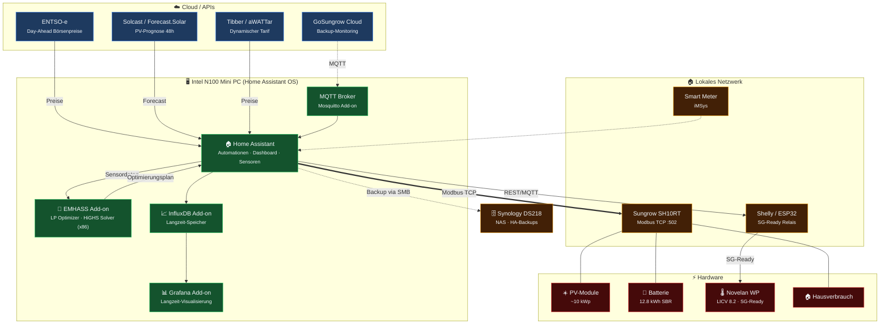
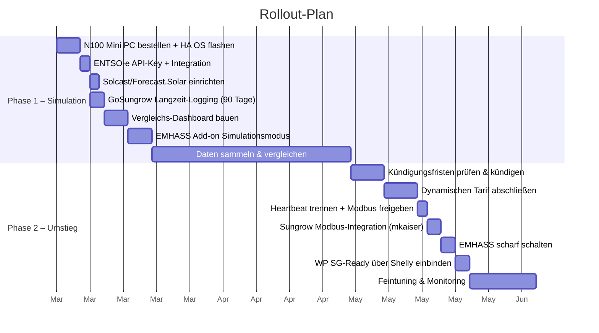

# DIY Energy Management – Architektur

> Intel N100 Mini PC (HA OS) · Sungrow SH10RT · 12.8 kWh Batterie · Novelan LICV 8.2

## Systemarchitektur

> Durchgezogene Linien = aktive Steuerung · Gestrichelte Linien = Monitoring / Backup · Dicke Linie = Modbus TCP

## Rollout-Phasen

## Hardware

| Komponente | Empfehlung | Preis |
|---|---|---|
| **HA-Server** | Intel N100 Mini PC (z.B. Beelink S12 Pro, 16GB/500GB) | ~180 € einmalig |
| **SG-Ready Relais** | Shelly Plus oder ESP32 Relay | ~15 € einmalig |

> **Warum N100?** x86_64-Architektur → EMHASS HiGHS-Solver läuft nativ (auf ARM nur GLPK). 16 GB RAM = Headroom für alle Add-ons. NVMe SSD = keine SD-Karten-Ausfälle. ~10W idle = ~25 €/Jahr Strom.

## Software-Komponenten

| Komponente | Rolle | Kosten |
|---|---|---|
| **Home Assistant OS** | Basis-System auf N100 Mini PC | Kostenlos |
| **ENTSO-e** | Börsenpreise (Phase 1) | Kostenlos |
| **Tibber / aWATTar** | Dynamischer Tarif (Phase 2) | ~6 €/Mo |
| **Solcast / Forecast.Solar** | PV-Prognose 48h | Kostenlos |
| **Sungrow Modbus (mkaiser)** | Inverter + Batterie Steuerung | Kostenlos |
| **EMHASS Add-on** | LP-Optimierer · HiGHS Solver (Heartbeat-Ersatz) | Kostenlos |
| **Novelan SG-Ready** | WP-Steuerung via Shelly/ESP32 | Kostenlos |
| **GoSungrow Cloud** | Backup-Monitoring via MQTT | Kostenlos |
| **InfluxDB + Grafana** | Langzeit-Analyse | Kostenlos |

> **Laufende Kosten: ~6 €/Mo** (nur Tibber Grundgebühr) vs. ~34 €/Mo bei 1komma5° → **Ersparnis ~336 €/Jahr**
>
> **Einmalige Kosten: ~195 €** (N100 + Shelly) – amortisiert sich in ~7 Monaten
