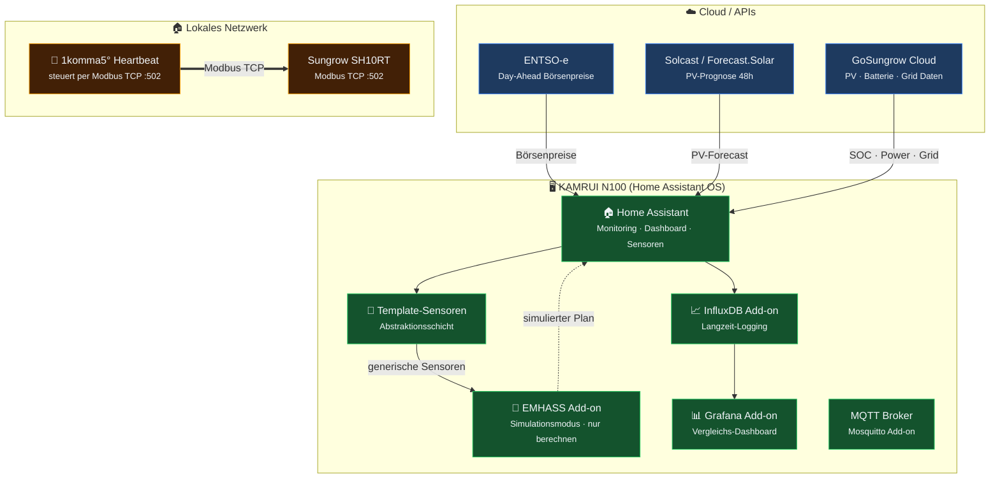
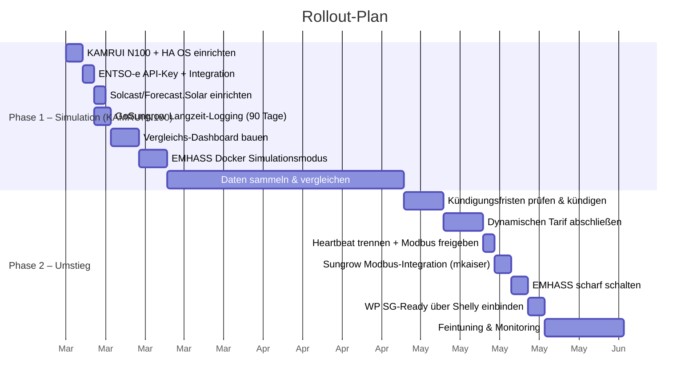

# DIY Energy Management – Architektur

> KAMRUI N100 (HA OS) · Synology DS218+ (NAS/Backup) · Sungrow SH10RT · 12.8 kWh Batterie · Novelan LICV 8.2

## Phase 1: Parallelbetrieb (Simulation)

> Heartbeat steuert weiterhin per Modbus. HA liest nur über GoSungrow Cloud-API. Kein Modbus-Konflikt.

> HA hat **keinen Modbus-Zugriff** – alle Daten kommen über GoSungrow Cloud-API. EMHASS berechnet, was es tun **würde**, führt aber nichts aus. Heartbeat bleibt alleiniger Steuerer.

## Phase 2: Systemarchitektur (nach Umstieg)

> Durchgezogene Linien = aktive Steuerung · Gestrichelte Linien = Monitoring / Backup · Dicke Linie = Modbus TCP

## Rollout-Phasen

## Hardware

### HA-Server: KAMRUI N100 (bestellt)

| Spec | Detail |
|---|---|
| **CPU** | Intel N100 (x86_64, 4C/4T, 3.4 GHz) |
| **RAM** | 16 GB DDR4 |
| **Storage** | 512 GB SSD |
| **Stromverbrauch** | ~8W idle (~21 €/Jahr) |
| **Preis** | 179,99 € |

> HA OS wird direkt geflasht (kein Windows). HiGHS-Solver läuft nativ (x86_64).
> 16 GB RAM = Headroom für alle Add-ons.

### Weitere Hardware

| Komponente | Empfehlung | Preis |
|---|---|---|
| **SG-Ready Relais** | Shelly Plus oder ESP32 Relay | ~15 € einmalig |

## Software-Komponenten

| Komponente | Rolle | Kosten |
|---|---|---|
| **Home Assistant OS** | Auf KAMRUI N100 | Kostenlos |
| **ENTSO-e** | Börsenpreise | Kostenlos |
| **Tibber / aWATTar** | Dynamischer Tarif (Phase 2) | ~6 €/Mo |
| **Solcast / Forecast.Solar** | PV-Prognose 48h | Kostenlos |
| **Sungrow Modbus (mkaiser)** | Inverter + Batterie Steuerung (Phase 2) | Kostenlos |
| **EMHASS** | LP-Optimierer · HiGHS Solver (Heartbeat-Ersatz) | Kostenlos |
| **Novelan SG-Ready** | WP-Steuerung via Shelly/ESP32 (Phase 2) | Kostenlos |
| **GoSungrow Cloud** | Monitoring via MQTT | Kostenlos |
| **InfluxDB + Grafana** | Langzeit-Analyse | Kostenlos |

> **Laufende Kosten (Phase 2): ~6 €/Mo** (nur Tibber Grundgebühr) vs. ~34 €/Mo bei 1komma5° → **Ersparnis ~336 €/Jahr**
>
> **Einmalige Kosten: ~195 €** (KAMRUI 179,99 € + Shelly ~15 €) – amortisiert sich in ~7 Monaten

## Entscheidungslog

### EMHASS statt evcc (März 2026)

evcc wurde als Alternative für das Batterie-Management evaluiert. Ergebnis: **nicht geeignet** für diesen Use Case.

| Kriterium | evcc | EMHASS |
|---|---|---|
| Ohne Wallbox nutzbar | Nein (Dummy-Workaround, unsupported) | Ja |
| Optimierung | Einfacher Preisschwellwert | LP-Optimierer (PV + Last + Preis) |
| Tägliche Anpassung | Manuell / Cron-Script nötig | Automatisch (Day-Ahead-Plan) |
| Sungrow SH10RT | Supported, aber bekannte Bugs | Über HA Modbus-Integration |

evcc wäre nur relevant bei einem späteren E-Auto mit Wallbox – dann als Ergänzung neben EMHASS.
