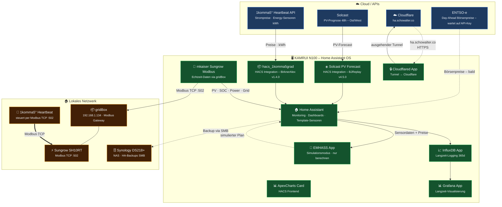
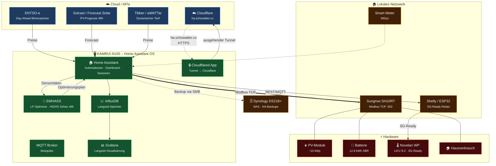
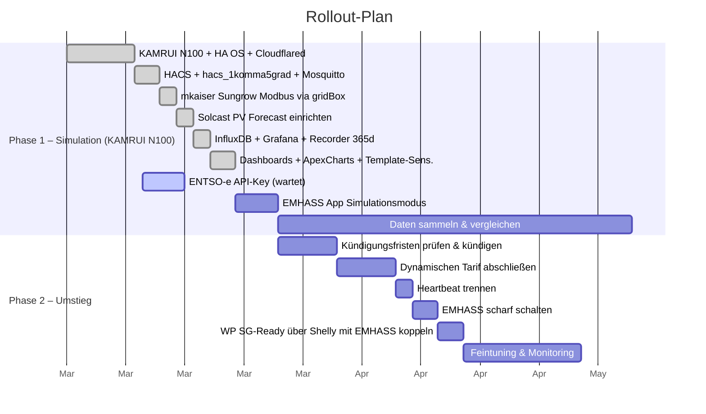

# DIY Energy Management – Architektur

> KAMRUI N100 (HA OS) · Synology DS218+ (NAS/Backup) · Sungrow SH10RT · 12.8 kWh Batterie · Novelan LICV 8.2

## Phase 1: Parallelbetrieb (Simulation)

> Heartbeat steuert weiterhin per Modbus. HA liest **parallel über die gridBox** (zweiter Modbus-Client). Kein Konflikt beobachtet.

```mermaid
graph TB
    subgraph CLOUD["☁️ Cloud / APIs"]
        ENTSOE["ENTSO-e<br/><small>Day-Ahead Börsenpreise – wartet auf API-Key</small>"]
        SOLCAST["Solcast<br/><small>PV-Prognose 48h – Ost/West</small>"]
        HB_API["1komma5° Heartbeat API<br/><small>Strompreise · Energy-Sensoren kWh</small>"]
        CF["☁️ Cloudflare<br/><small>ha.schowalter.co</small>"]
    end

    subgraph N100P1["🖥️ KAMRUI N100 – Home Assistant OS"]
        HAP1["🏠 Home Assistant<br/><small>Monitoring · Dashboards · Template-Sensoren</small>"]
        HACS_1K5["📦 hacs_1komma5grad<br/><small>HACS Integration – BirknerAlex v1.4.0</small>"]
        MODBUS["📡 mkaiser Sungrow Modbus<br/><small>Echtzeit-Daten via gridBox</small>"]
        SOLCAST_INT["☀️ Solcast PV Forecast<br/><small>HACS Integration – BJReplay v4.5.0</small>"]
        APEX["📊 ApexCharts Card<br/><small>HACS Frontend</small>"]
        EMHASSP1["🧠 EMHASS App<br/><small>Simulationsmodus · nur berechnen</small>"]
        INFLUXP1["📈 InfluxDB App<br/><small>Langzeit-Logging 365d</small>"]
        GRAFANAP1["📊 Grafana App<br/><small>Langzeit-Visualisierung</small>"]
        CFD_P1["🔒 Cloudflared App<br/><small>Tunnel → Cloudflare</small>"]
    end

    subgraph LOKAL1["🏠 Lokales Netzwerk"]
        HEARTBEAT["💚 1komma5° Heartbeat<br/><small>steuert per Modbus TCP :502</small>"]
        GRIDBOX["📦 gridBox<br/><small>192.168.1.134 · Modbus Gateway</small>"]
        SUNGROW1["⚡ Sungrow SH10RT<br/><small>Modbus TCP :502</small>"]
        SYNOLOGY["🗄️ Synology DS218+<br/><small>NAS · HA-Backups SMB</small>"]
    end

    %% Cloud → HA
    ENTSOE -.->|"Börsenpreise – bald"| HAP1
    SOLCAST -->|PV-Forecast| SOLCAST_INT
    SOLCAST_INT --> HAP1
    HB_API -->|Preise · kWh| HACS_1K5
    HACS_1K5 --> HAP1

    %% Lokaler Modbus-Zugriff – nur lesend, parallel zu Heartbeat
    MODBUS -->|Modbus TCP :502| GRIDBOX
    GRIDBOX --- SUNGROW1
    MODBUS -->|PV · SOC · Power · Grid| HAP1

    %% HA → EMHASS Simulation
    HAP1 -->|Sensordaten + Preise| EMHASSP1
    EMHASSP1 -.->|simulierter Plan| HAP1
    HAP1 --> INFLUXP1
    INFLUXP1 --> GRAFANAP1

    %% Heartbeat steuert parallel
    HEARTBEAT ==>|Modbus TCP| SUNGROW1

    %% Backup + Remote
    HAP1 -.->|Backup via SMB| SYNOLOGY
    CFD_P1 -->|ausgehender Tunnel| CF
    CF -.->|"ha.schowalter.co<br/>HTTPS"| CFD_P1

    %% Styling
    classDef cloud fill:#1e3a5f,stroke:#3b82f6,color:#f1f5f9
    classDef haos fill:#14532d,stroke:#22c55e,color:#f1f5f9
    classDef lokal fill:#422006,stroke:#f59e0b,color:#f1f5f9

    class ENTSOE,SOLCAST,HB_API,CF cloud
    class HAP1,HACS_1K5,MODBUS,SOLCAST_INT,APEX,EMHASSP1,INFLUXP1,GRAFANAP1,CFD_P1 haos
    class HEARTBEAT,GRIDBOX,SUNGROW1,SYNOLOGY lokal
```

> HA liest Inverterdaten **parallel zu Heartbeat** über die gridBox (Modbus-Gateway, 192.168.1.134). Strompreise kommen von [hacs_1komma5grad](https://github.com/BirknerAlex/hacs_1komma5grad) (→ ADR-0014), PV-Prognosen von Solcast. EMHASS berechnet, was es tun **würde**, führt aber nichts aus. Heartbeat bleibt alleiniger Steuerer.

## Phase 2: Systemarchitektur (nach Umstieg)

```mermaid
graph TB
    subgraph CLOUD["☁️ Cloud / APIs"]
        ENTSOE["ENTSO-e<br/><small>Day-Ahead Börsenpreise</small>"]
        SOLCAST["Solcast / Forecast.Solar<br/><small>PV-Prognose 48h</small>"]
        TIBBER["Tibber / aWATTar<br/><small>Dynamischer Tarif</small>"]
        CF["☁️ Cloudflare<br/><small>ha.schowalter.co</small>"]
    end

    subgraph SERVER["🖥️ KAMRUI N100 – Home Assistant OS"]
        HA["🏠 Home Assistant<br/><small>Automationen · Dashboard · Sensoren</small>"]
        EMHASS["🧠 EMHASS<br/><small>LP Optimizer · HiGHS Solver x86</small>"]
        MQTT["MQTT Broker<br/><small>Mosquitto</small>"]
        GRAFANA["📊 Grafana<br/><small>Langzeit-Visualisierung</small>"]
        INFLUX["📈 InfluxDB<br/><small>Langzeit-Speicher</small>"]
        CFD["🔒 Cloudflared App<br/><small>Tunnel → Cloudflare</small>"]
    end

    subgraph LOKAL["🏠 Lokales Netzwerk"]
        SUNGROW["Sungrow SH10RT<br/><small>Modbus TCP :502</small>"]
        METER["Smart Meter<br/><small>iMSys</small>"]
        SHELLY["Shelly / ESP32<br/><small>SG-Ready Relais</small>"]
    end

    subgraph HARDWARE["⚡ Hardware"]
        PV["☀️ PV-Module<br/><small>~10 kWp</small>"]
        BATTERIE["🔋 Batterie<br/><small>12.8 kWh SBR</small>"]
        WP["🌡️ Novelan WP<br/><small>LICV 8.2 · SG-Ready</small>"]
        HAUS["🏠 Hausverbrauch"]
    end

    %% Cloud → HA
    ENTSOE -->|Preise| HA
    SOLCAST -->|Forecast| HA
    TIBBER -->|Preise| HA
    HA ==>|Modbus TCP| SUNGROW

    %% HA ↔ Apps
    HA -->|Sensordaten| EMHASS
    EMHASS -->|Optimierungsplan| HA
    HA --> INFLUX
    INFLUX --> GRAFANA

    SYNOLOGY["🗄️ Synology DS218+<br/><small>NAS · HA-Backups</small>"]

    %% HA → Lokal
    HA -->|REST/MQTT| SHELLY
    HA -.->|Backup via SMB| SYNOLOGY
    METER -.-> HA

    %% Cloudflare Tunnel (Remote-Zugriff)
    CFD -->|ausgehender Tunnel| CF
    CF -.->|"ha.schowalter.co<br/>HTTPS"| CFD

    %% Lokal → Hardware
    SUNGROW --- PV
    SUNGROW --- BATTERIE
    SHELLY -->|SG-Ready| WP
    SUNGROW --- HAUS

    %% Styling
    classDef cloud fill:#1e3a5f,stroke:#3b82f6,color:#f1f5f9
    classDef haos fill:#14532d,stroke:#22c55e,color:#f1f5f9
    classDef lokal fill:#422006,stroke:#f59e0b,color:#f1f5f9
    classDef hw fill:#450a0a,stroke:#ef4444,color:#f1f5f9

    class ENTSOE,SOLCAST,TIBBER,CF cloud
    class HA,EMHASS,MQTT,GRAFANA,INFLUX,CFD haos
    class SUNGROW,METER,SHELLY,SYNOLOGY lokal
    class PV,BATTERIE,WP,HAUS hw
```

> Durchgezogene Linien = aktive Steuerung · Gestrichelte Linien = Monitoring / Backup · Dicke Linie = Modbus TCP

## Rollout-Phasen

```mermaid
gantt
    title Rollout-Plan
    dateFormat YYYY-MM-DD
    axisFormat %b

    section Phase 1 – Simulation (KAMRUI N100)
    KAMRUI N100 + HA OS + Cloudflared       :done, p1hw, 2026-03-01, 8d
    HACS + hacs_1komma5grad + Mosquitto     :done, p1hacs, after p1hw, 3d
    mkaiser Sungrow Modbus via gridBox      :done, p1mod, after p1hacs, 2d
    Solcast PV Forecast einrichten          :done, p1b, after p1mod, 2d
    InfluxDB + Grafana + Recorder 365d      :done, p1d, after p1b, 2d
    Dashboards + ApexCharts + Template-Sens.:done, p1e, after p1d, 3d
    ENTSO-e API-Key (wartet)                :active, p1a, 2026-03-10, 5d
    EMHASS App Simulationsmodus             :p1f, after p1e, 5d
    Daten sammeln & vergleichen             :p1g, after p1f, 42d

    section Phase 2 – Umstieg
    Kündigungsfristen prüfen & kündigen     :p2a, after p1f, 7d
    Dynamischen Tarif abschließen           :p2b, after p2a, 7d
    Heartbeat trennen                       :p2c, after p2b, 2d
    EMHASS scharf schalten                  :p2e, after p2c, 3d
    WP SG-Ready über Shelly mit EMHASS koppeln :p2f, after p2e, 3d
    Feintuning & Monitoring                 :p2g, after p2f, 14d
```

## Hardware

### HA-Server: KAMRUI N100 (installiert)

| Spec | Detail |
|---|---|
| **CPU** | Intel N100 (x86_64, 4C/4T, 3.4 GHz) |
| **RAM** | 16 GB DDR4 |
| **Storage** | 512 GB SSD |
| **OS** | Home Assistant OS 17.1 |
| **Remote-Zugriff** | https://ha.schowalter.co (Cloudflare Tunnel) |
| **Stromverbrauch** | ~8W idle (~21 €/Jahr) |
| **Preis** | 179,99 € |

> HA OS direkt geflasht (kein Windows). HiGHS-Solver läuft nativ (x86_64).
> 16 GB RAM = Headroom für alle Apps.

### Weitere Hardware

| Komponente | Empfehlung | Preis |
|---|---|---|
| **SG-Ready Relais** | Shelly Plus oder ESP32 Relay | ~15 € einmalig |

## Software-Komponenten

| Komponente | Rolle | Kosten |
|---|---|---|
| **Home Assistant OS** | Auf KAMRUI N100 | Kostenlos |
| **ENTSO-e** | Börsenpreise | Kostenlos |
| **Tibber / aWATTar** | Dynamischer Tarif (Phase 2) | ~6 €/Mo Grundgebühr |
| **Solcast / Forecast.Solar** | PV-Prognose 48h | Kostenlos |
| **Sungrow Modbus (mkaiser)** | Inverter + Batterie Echtzeit-Daten via gridBox | Kostenlos |
| **EMHASS** | LP-Optimierer · HiGHS Solver (Heartbeat-Ersatz) | Kostenlos |
| **Novelan SG-Ready** | WP-Steuerung via Shelly/ESP32 (Phase 2) | Kostenlos |
| **1komma5grad HACS** | Heartbeat-Preise + Energy-Sensoren (Phase 1) | Kostenlos |
| **Solcast PV Forecast** | PV-Prognose 48h (Ost/West, 2 Sites) | Kostenlos |
| **ApexCharts Card** | Erweiterte Dashboard-Graphen (HACS Frontend) | Kostenlos |
| **Cloudflared** | Cloudflare Tunnel · Remote-Zugriff via ha.schowalter.co | Kostenlos |
| **InfluxDB + Grafana** | Langzeit-Analyse | Kostenlos |

> **Fixkosten-Vergleich:**
> Tarifunabhängig (beide Szenarien): ~12 €/Mo (Messstellenbetrieb ~5,85 € + Netzentgelt/TEPA ~6 €)
> 1komma5°: + ~22 €/Mo (Energy Trader + Dynamic Pulse + Gebühren) = **~34 €/Mo gesamt**
> Tibber: + ~6 €/Mo Grundgebühr = **~18 €/Mo gesamt**
> **Differenz: ~10 €/Mo → ~120 €/Jahr** + Einsparungen durch bessere Optimierung
>
> **Einmalige Kosten: ~195 €** (KAMRUI 179,99 € + Shelly ~15 €) – amortisiert sich in ~20 Monaten durch Fixkosten allein, schneller mit Optimierungsgewinnen

## Entscheidungslog (ADRs)

Alle Technologieentscheidungen sind als Architecture Decision Records dokumentiert:

| ADR | Entscheidung | Status |
|---|---|---|
| [ADR-0001](adr/0001-kamrui-n100-als-ha-server.md) | KAMRUI N100 als HA-Server | Akzeptiert |
| [ADR-0002](adr/0002-home-assistant-os.md) | Home Assistant OS als Betriebssystem | Akzeptiert |
| [ADR-0003](adr/0003-emhass-als-energieoptimierer.md) | EMHASS als Energieoptimierer | Akzeptiert |
| [ADR-0004](adr/0004-entsoe-fuer-boersenpreise.md) | ENTSO-e für Börsenpreise | Akzeptiert |
| [ADR-0005](adr/0005-solcast-fuer-pv-prognose.md) | Solcast / Forecast.Solar für PV-Prognose | Vorgeschlagen |
| [ADR-0006](adr/0006-gosungrow-cloud-api-phase1.md) | ~~GoSungrow~~ → mkaiser Sungrow Modbus via gridBox | Superseded |
| [ADR-0007](adr/0007-mkaiser-sungrow-modbus-phase2.md) | mkaiser Sungrow-Modbus (bereits in Phase 1 aktiv) | Akzeptiert |
| [ADR-0008](adr/0008-template-sensoren-abstraktionsschicht.md) | ~~Abstraktionsschicht~~ → direkte mkaiser-Entities + KPI-Sensoren | Superseded |
| [ADR-0009](adr/0009-influxdb-grafana-langzeitmonitoring.md) | InfluxDB + Grafana für Monitoring | Akzeptiert |
| [ADR-0010](adr/0010-mosquitto-mqtt-broker.md) | Mosquitto als MQTT Broker | Akzeptiert |
| [ADR-0011](adr/0011-shelly-sg-ready-wp-steuerung.md) | Shelly Relay für SG-Ready WP-Steuerung | Akzeptiert |
| [ADR-0012](adr/0012-dynamischer-stromtarif.md) | Dynamischer Stromtarif (Tibber/aWATTar) | Vorgeschlagen |
| [ADR-0013](adr/0013-energiemanagement-ansatz.md) | Energiemanagement: EMHASS vs. Heartbeat vs. iHomeManager | Akzeptiert |
| [ADR-0014](adr/0014-1komma5grad-hacs-integration.md) | 1komma5grad HACS-Integration für Heartbeat-Daten (Phase 1) | Akzeptiert |
| [ADR-0015](adr/0015-cloudflare-tunnel-remote-zugriff.md) | Cloudflare Tunnel für Remote-Zugriff | Akzeptiert |
