# DIY Energy Management – Architektur

> Intel N100 Mini PC (HA OS) · Sungrow SH10RT · 12.8 kWh Batterie · Novelan LICV 8.2

## Systemarchitektur

```mermaid
graph TB
    subgraph CLOUD["☁️ Cloud / APIs"]
        ENTSOE["ENTSO-e<br/><small>Day-Ahead Börsenpreise</small>"]
        SOLCAST["Solcast / Forecast.Solar<br/><small>PV-Prognose 48h</small>"]
        TIBBER["Tibber / aWATTar<br/><small>Dynamischer Tarif</small>"]
        GOSUNGROW["GoSungrow Cloud<br/><small>Backup-Monitoring</small>"]
    end

    subgraph N100["🖥️ Intel N100 Mini PC (Home Assistant OS)"]
        HA["🏠 Home Assistant<br/><small>Automationen · Dashboard · Sensoren</small>"]
        EMHASS["🧠 EMHASS Add-on<br/><small>LP Optimizer · HiGHS Solver (x86)</small>"]
        MQTT["MQTT Broker<br/><small>Mosquitto Add-on</small>"]
        GRAFANA["📊 Grafana Add-on<br/><small>Langzeit-Visualisierung</small>"]
        INFLUX["📈 InfluxDB Add-on<br/><small>Langzeit-Speicher</small>"]
    end

    subgraph LOKAL["🏠 Lokales Netzwerk"]
        SUNGROW["Sungrow SH10RT<br/><small>Modbus TCP :502</small>"]
        METER["Smart Meter<br/><small>iMSys</small>"]
        SHELLY["Shelly / ESP32<br/><small>SG-Ready Relais</small>"]
    end

    subgraph HARDWARE["⚡ Hardware"]
        PV["☀️ PV-Module<br/><small>~10 kWp</small>"]
        BATTERIE["🔋 Batterie<br/><small>12.8 kWh SBR</small>"]
        WP["🌡️ Novelan WP<br/><small>LICV 8.2 · SG-Ready</small>"]
        HAUS["🏠 Hausverbrauch"]
    end

    %% Cloud → HA
    ENTSOE -->|Preise| HA
    SOLCAST -->|Forecast| HA
    TIBBER -->|Preise| HA
    GOSUNGROW -.->|MQTT| MQTT
    MQTT --> HA

    %% HA ↔ Add-ons
    HA -->|Sensordaten| EMHASS
    EMHASS -->|Optimierungsplan| HA
    HA --> INFLUX
    INFLUX --> GRAFANA

    SYNOLOGY["🗄️ Synology DS218<br/><small>NAS · HA-Backups</small>"]

    %% HA → Lokal
    HA ==>|Modbus TCP| SUNGROW
    HA -->|REST/MQTT| SHELLY
    HA -.->|Backup via SMB| SYNOLOGY
    METER -.-> HA

    %% Lokal → Hardware
    SUNGROW --- PV
    SUNGROW --- BATTERIE
    SHELLY -->|SG-Ready| WP
    SUNGROW --- HAUS

    %% Styling
    classDef cloud fill:#1e3a5f,stroke:#3b82f6,color:#f1f5f9
    classDef haos fill:#14532d,stroke:#22c55e,color:#f1f5f9
    classDef lokal fill:#422006,stroke:#f59e0b,color:#f1f5f9
    classDef hw fill:#450a0a,stroke:#ef4444,color:#f1f5f9

    class ENTSOE,SOLCAST,TIBBER,GOSUNGROW cloud
    class HA,EMHASS,MQTT,GRAFANA,INFLUX haos
    class SUNGROW,METER,SHELLY,SYNOLOGY lokal
    class PV,BATTERIE,WP,HAUS hw
```

> Durchgezogene Linien = aktive Steuerung · Gestrichelte Linien = Monitoring / Backup · Dicke Linie = Modbus TCP

## Rollout-Phasen

```mermaid
gantt
    title Rollout-Plan
    dateFormat YYYY-MM-DD
    axisFormat %b

    section Phase 1 – Simulation
    N100 Mini PC bestellen + HA OS flashen  :p1hw, 2026-03-01, 5d
    ENTSO-e API-Key + Integration           :p1a, after p1hw, 2d
    Solcast/Forecast.Solar einrichten       :p1b, after p1a, 2d
    GoSungrow Langzeit-Logging (90 Tage)    :p1c, after p1a, 3d
    Vergleichs-Dashboard bauen              :p1d, after p1c, 5d
    EMHASS Add-on Simulationsmodus          :p1e, after p1d, 5d
    Daten sammeln & vergleichen             :p1f, after p1e, 42d

    section Phase 2 – Umstieg
    Kündigungsfristen prüfen & kündigen     :p2a, after p1f, 7d
    Dynamischen Tarif abschließen           :p2b, after p2a, 7d
    Heartbeat trennen + Modbus freigeben    :p2c, after p2b, 2d
    Sungrow Modbus-Integration (mkaiser)    :p2d, after p2c, 3d
    EMHASS scharf schalten                  :p2e, after p2d, 3d
    WP SG-Ready über Shelly einbinden       :p2f, after p2e, 3d
    Feintuning & Monitoring                 :p2g, after p2f, 14d
```

## Hardware

| Komponente | Empfehlung | Preis |
|---|---|---|
| **HA-Server** | Intel N100 Mini PC (z.B. Beelink S12 Pro, 16GB/500GB) | ~180 € einmalig |
| **SG-Ready Relais** | Shelly Plus oder ESP32 Relay | ~15 € einmalig |

> **Warum N100?** x86_64-Architektur → EMHASS HiGHS-Solver läuft nativ (auf ARM nur GLPK). 16 GB RAM = Headroom für alle Add-ons. NVMe SSD = keine SD-Karten-Ausfälle. ~10W idle = ~25 €/Jahr Strom.

## Software-Komponenten

| Komponente | Rolle | Kosten |
|---|---|---|
| **Home Assistant OS** | Basis-System auf N100 Mini PC | Kostenlos |
| **ENTSO-e** | Börsenpreise (Phase 1) | Kostenlos |
| **Tibber / aWATTar** | Dynamischer Tarif (Phase 2) | ~6 €/Mo |
| **Solcast / Forecast.Solar** | PV-Prognose 48h | Kostenlos |
| **Sungrow Modbus (mkaiser)** | Inverter + Batterie Steuerung | Kostenlos |
| **EMHASS Add-on** | LP-Optimierer · HiGHS Solver (Heartbeat-Ersatz) | Kostenlos |
| **Novelan SG-Ready** | WP-Steuerung via Shelly/ESP32 | Kostenlos |
| **GoSungrow Cloud** | Backup-Monitoring via MQTT | Kostenlos |
| **InfluxDB + Grafana** | Langzeit-Analyse | Kostenlos |

> **Laufende Kosten: ~6 €/Mo** (nur Tibber Grundgebühr) vs. ~34 €/Mo bei 1komma5° → **Ersparnis ~336 €/Jahr**
>
> **Einmalige Kosten: ~195 €** (N100 + Shelly) – amortisiert sich in ~7 Monaten
